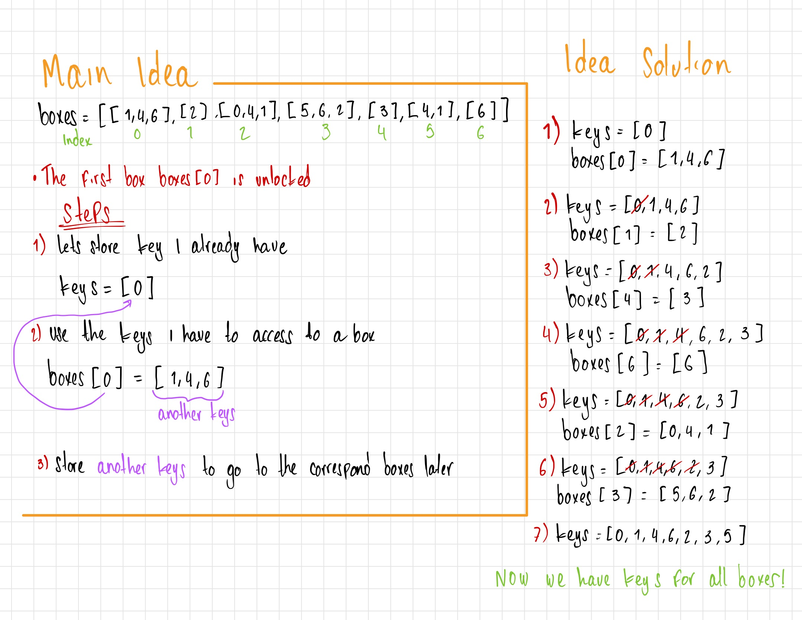

# [Lockboxes](https://intranet.hbtn.io/projects/498)

<html>
<div class="panel panel-default" id="project-description">
 <div class="panel-body">
  <h2>
   Requirements
  </h2>
  <h3>
   General
  </h3>
  <ul>
   <li>
    Allowed editors:
    <code>
     vi
    </code>
    ,
    <code>
     vim
    </code>
    ,
    <code>
     emacs
    </code>
   </li>
   <li>
    All your files will be interpreted/compiled on Ubuntu 14.04 LTS using
    <code>
     python3
    </code>
    (version 3.4.3)
   </li>
   <li>
    All your files should end with a new line
   </li>
   <li>
    The first line of all your files should be exactly
    <code>
     #!/usr/bin/python3
    </code>
   </li>
   <li>
    A
    <code>
     README.md
    </code>
    file, at the root of the folder of the project, is mandatory
   </li>
   <li>
    Your code should be documented
   </li>
   <li>
    Your code should use the
    <code>
     PEP 8
    </code>
    style (version 1.7.x)
   </li>
   <li>
    All your files must be executable
   </li>
  </ul>
 </div>
 <br>
 </br>
</div>

# Task: Lockboxes

You have n number of locked boxes in front of you. Each box is numbered sequentially from 0 to n - 1 and each box may contain keys to the other boxes.

Write a method that determines if all the boxes can be opened.

- Prototype: def canUnlockAll(boxes)
- boxes is a list of lists
- A key with the same number as a box opens that box
- You can assume all keys will be positive integers
- The first box boxes[0] is unlocked
- Return True if all boxes can be opened, else return False

```sh
carrie@ubuntu:~/0x00-lockboxes$ cat main_0.py
#!/usr/bin/python3

canUnlockAll = __import__('0-lockboxes').canUnlockAll

boxes = [[1], [2], [3], [4], []]
print(canUnlockAll(boxes))

boxes = [[1, 4, 6], [2], [0, 4, 1], [5, 6, 2], [3], [4, 1], [6]]
print(canUnlockAll(boxes))

boxes = [[1, 4], [2], [0, 4, 1], [3], [], [4, 1], [5, 6]]
print(canUnlockAll(boxes))

carrie@ubuntu:~/0x00-lockboxes$
```

```sh
carrie@ubuntu:~/0x00-lockboxes$ ./main_0.py
True
True
False
carrie@ubuntu:~/0x00-lockboxes$
```

# Whiteboarding


[--LINK PROJECT--](https://intranet.hbtn.io/projects/498)
</html>